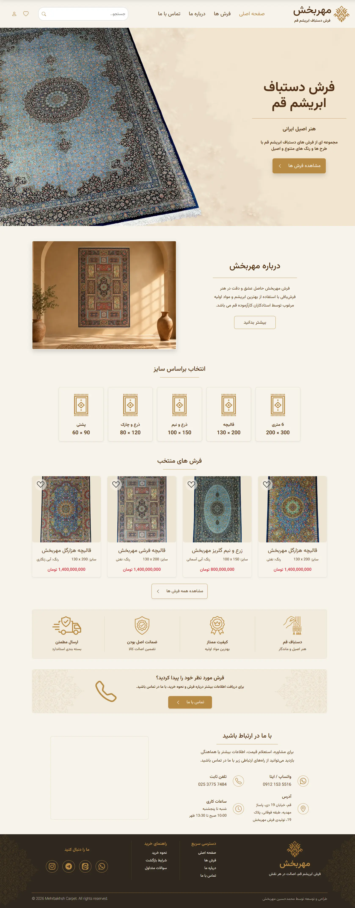
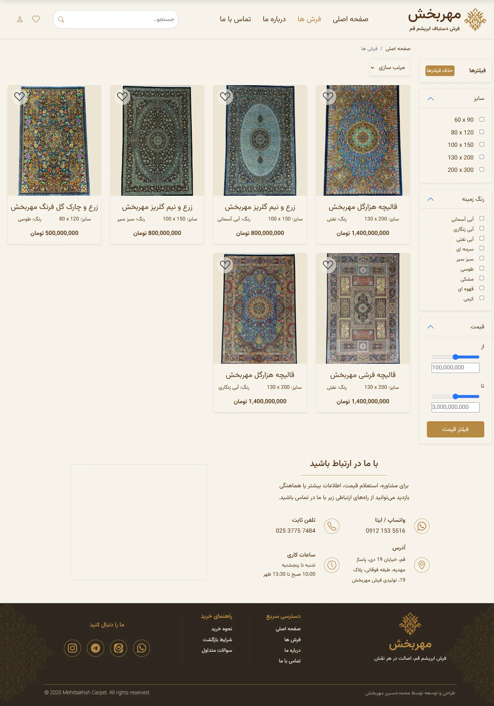

# Mehrbakhsh Carpet 🧶

A responsive and modern product showcase website for Mehrbakhsh, a handmade Persian silk carpet collection based in Qom, Iran.

The website is designed as a digital catalog to showcase carpets, their details, colors, sizes, and images, while providing customers with direct contact options instead of an online checkout system.

# 🚧 Project Status: In Progress

# 🌐 Live Website

mehrbakhshcarpet.ir

# 📸 About the Project

Mehrbakhsh Carpet is a real-world Front-End project developed from scratch with a focus on creating a luxurious, responsive, and user-friendly experience.

The project includes a product catalog, detailed product pages, search and filtering functionality, color-based product images, and responsive layouts for different screen sizes.

The website is currently under active development, and additional features and performance improvements will be added over time.

# ✨ Features
* Responsive design for desktop, tablet, and mobile
* Luxury-oriented UI designed specifically for a Persian carpet brand
* Product listing and product detail pages
* Product search
* Product filtering
* Color-based product selection
* Different images for each carpet color
* Dynamic product information using JavaScript
* URL query parameters for product and color selection
* Favorites functionality
* Contact section with social media links
* RTL layout for Persian content
* Mobile navigation and responsive filtering UI

# 🛠️ Tech Stack
* HTML5
* CSS3
* JavaScript (Vanilla JS)
* Bootstrap 5
* Bootstrap Icons

# 🎯 Project Goals
The main goals of this project are:

* Building a real-world Front-End website from scratch
* Creating a professional and responsive user interface
* Practicing JavaScript through a real product catalog
* Working with structured product data
* Implementing search and filtering logic
* Managing product and variant information dynamically
* Improving performance and image loading
* Creating a maintainable project structure

# 📱 Responsive Design
The website is designed to work across different screen sizes, including:

* Desktop
* Laptop
* Tablet
* Mobile

Responsive behavior is implemented throughout the project rather than being added as a final step, helping maintain a consistent user experience across different devices.

# 🚧 Development Status
The project is currently in active development.

Planned and ongoing improvements include:
* Image optimization
* Further performance improvements
* Refinement of search
* Completing and improving the favorites system
* Additional UI/UX refinements
* Further JavaScript improvements

# 📌 Notes
This project is primarily a product showcase and catalog website.

There is currently no online payment or checkout system. Customers can view carpet information and contact Mehrbakhsh directly for purchasing inquiries.

## Project Preview

# 👨‍💻 Developer

Hossein Mehrbakhsh

Front-End Developer